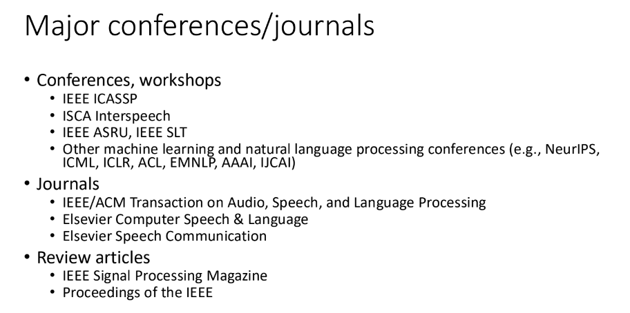
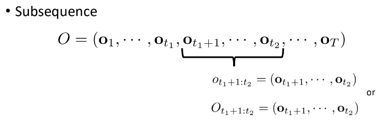
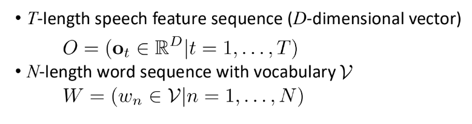
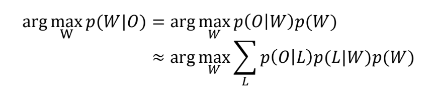

# Speech Recognition Formulation

9/9/2024

___

Conferences!

### Procedure

- Feature extraction $O$
- Transcription $W$
- find the most possible $W$ given $O$, by the MAP decision theory

## MAP decision theory

- estimate the most probably word sequence $\hat{W}$ among all possible word sequences $\mathbb{W}$

### Notations

e.g.

## Probability - revisited 

[IMPORTANT]

- product rule
  - $p(x|y)p(y) = p(x, y)$ 
- sum rule
  - $p(y) = \sum_{x} p(x, y)$
- conditional independence *assumption* 
  - $p(x|y, z) = p(x | z)$ 
    - given $z$, $x$ is independent of $y$
  - $p(x, y|z) = p(x|z)p(y|z)$
    - given $z$, $x$ and $y$ are conditionally independent
  
- Bayes rule
  - $p(x|y) = \frac{p(y|x)p(x)}{p(y)}$
  - $= \frac{p(y|x)p(x)}{\sum_{x}p(y|x)p(x)}$
- Viterbi approximation
  - $p(x|y) = \sum_{x}p(x, z|y) \approx \max p(x, z|y)$

## End-to-end Speech Recognition

- We just use the neural network (nn) to evaluate the probability

## Classical Speech Recognition 

idea: audio -> intermediate form

- get an intermediate representation (phoneme, feature vector)

- noisy channel modeld

1. feature extraction
2. acoustic modeling - $p(O|L)$
3. lexicon - $p(L|W)$
4. language modeling - $p(W)$

### Feature extraction

- soundwave is hard to deal with
  - use frames (usually 16kHz)
- Speech feature extraction modules
  - Mel-frequency cepstral coefficient (MFCC), Perceptual Linear Prediction (PLP) used for GMM
  - Log Mel filterbank for DNN

### Acoustic model

- acoustic modeling
  - HMM
- timescale: 10 milliseconds ~ 100 milliseconds
- non deterministic, give probability for phoneme sequences

### Lexicon

- use a dictionary to covert phoneme sequences to word sequences
  - new words, named entities need to be continuously added
  - grapheme2phoneme
- timescale: 100 milliseconds ~ 1 second
- require a pronunciation dictionary
- $p(L|W) = p(\text{/T/, /OW/} | \text{"two"})$
  - find probability of it is the word given a phoneme sequence
- Phone $\neq$ Phoneme
  - phone: IPA; hard to encode
  - phoneme: language specific; does not distinguish degenerated phones; simpler and can be encoded by ASCii

### Language model

- given different possible word sequences, some sequences are more likely than others
  - n-gram probability
    - by word sequence frequency in a large corpus
  - neural language model

