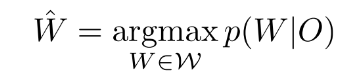
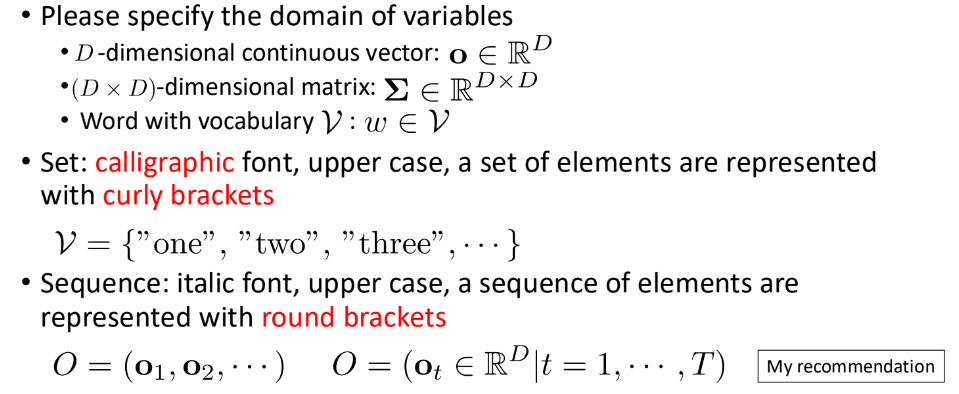
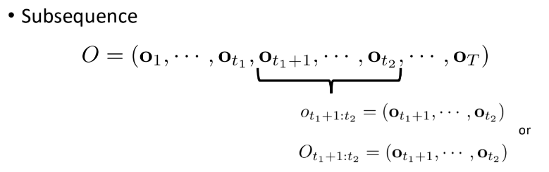
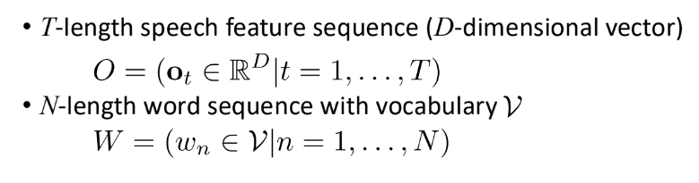

# Speech Recognition Formulation

9/9/2024

___

Conferences!

### Procedure

- Feature extraction $O$
- Transcription $W$
- find the most possible $W$ given $O$, by the MAP decision theory

## MAP decision theory

- estimate the most probably word sequence $\hat{W}$ among all possible word sequences $\mathbb{W}$

### Notations

e.g.

