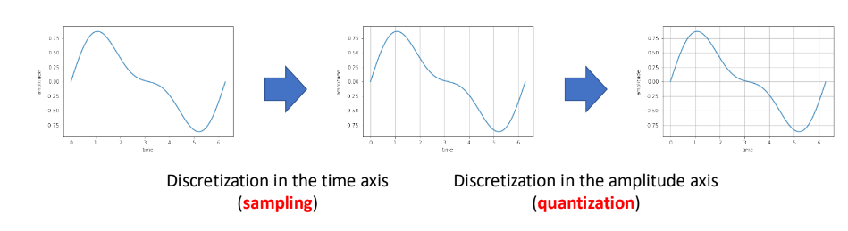
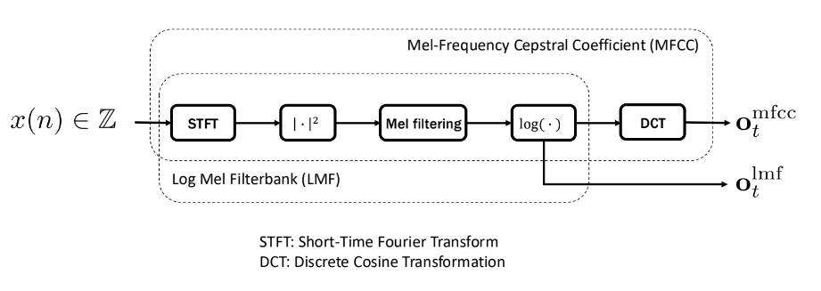
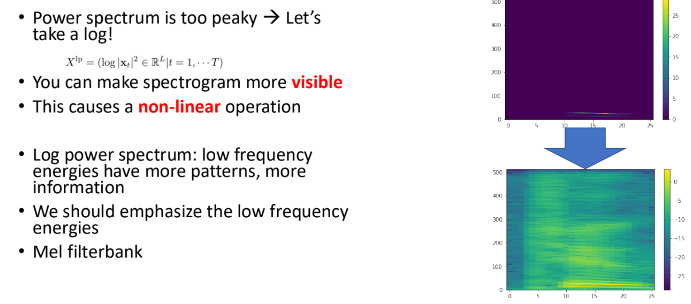
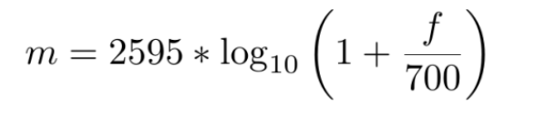
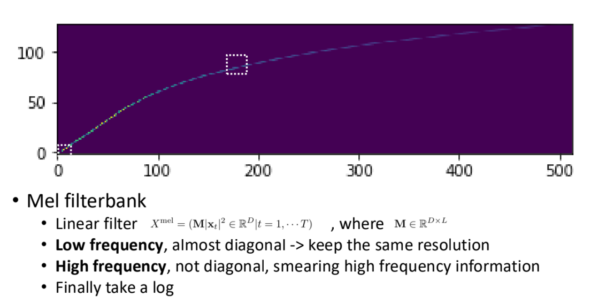

# Feature Extraction

9/11/2024

___

- very empirical --> very engineering!!
- A lot of things to consider
  - performance
  - computational complexity
  - on-line property
  - compatibility...

### Wavefront 

- air pressure into time series
- use 1-dimensional waveform (mono)
  - some device may support stereo?

## Wavefront Processing

- input wavefront
- sampling (by time dimension)
- quantization (by amplitude dimension)
- 
  - usually we just work with 16kHz sampling rate
  - and 16bit for amplitude
  - `WAV` format has sampling rate encoded on the file header
    - use `sox` to convert sampling rate

## Feature Extraction Pipeline

### Short-time Fourier Transformation

- extract periodic components from signals
  - convert wavefront to time-frequency representation
- reflect articulatory movement (from wavefront)
- capture periodic pattern
  - 10ms each frame
- use window function as a parameter
  - Hamming window, Hanning window...
  - window size ~25ms
  - window shift ~10ms
- similar to convolution

### 

### Number of Points vs. Milliseconds

- speech recognition community uses **milliseconds**
- speech processing community uses **points**

<points> = <sampling rate> / <window size> * 1000 

## Log Operation

## Mel filterbank

- many variations, scale is not unique

- mimic **human perception pattern**

  - non-linear

   

- applying **log mel filterbank**

  - cannot revert to sound signal
  - but could convert back to signal from **log power** (vocoder in TTS)

  

