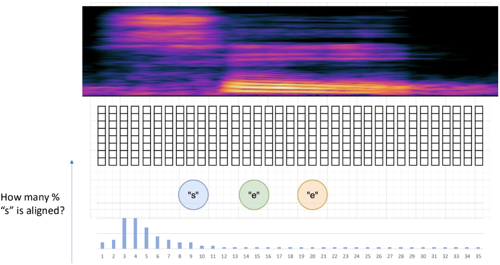
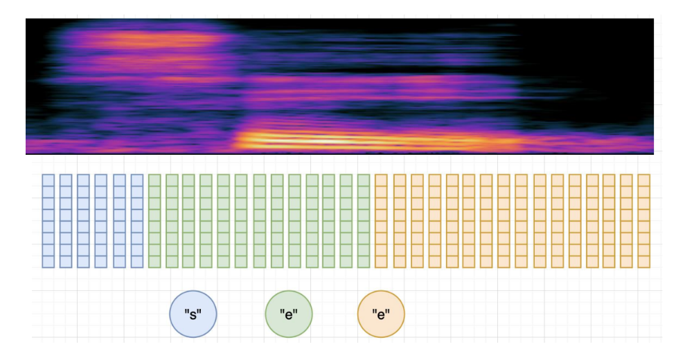
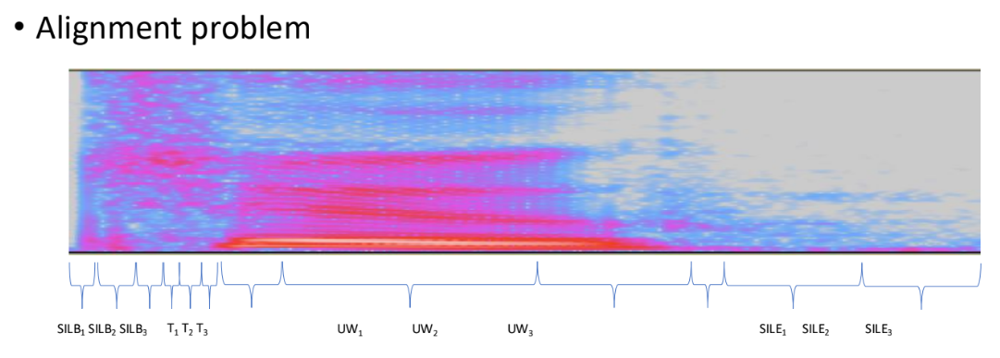

# Alignments

9/16/2024

___

> alignments in terms of aligning between speech and text, not the *AI alignment* one.

## output of ASR

- text, could be in different forms: words, characters, phonemes...

- **end-to-end**
  - *word*
    - out-of-vocab
    - less computation
    - larger mismatch
  - *character*
    - more computation cost
    - slighty less mismatch
  - *BPE*
    - in between ;)
    - work with subword sequences

- **classical** (involve in intermediate repr.)
  
  - *phoneme*
    
    - more acoustic
    - require a dictionary (CMU dictionary, grapheme2phoneme)
  - *state* (HMM state)
    
    - more acoustic than phoneme
    
    
    
## Alignments in different context

### end-to-end

- directly map speech feature sequence to word sequences
- does NOT deal with phoneme based intermediate repr.
- $P(W|O)$
  - **attention-based**
  - **connectionist temporal classification CTC**
  - **RNN**

### Classical - HMM

- $P(O|L)$

### attention-based ASR

- align $O$ with $W$
  - difficult because they have different length
  - align frames/speech features to text
- produce **soft alignments** (only here)
  - based on probability -> soft

### CTC

- produce **hard alignment**
  - frame to text mapping
  - with clear boundaries
- can compute the probability of different alignments
  - and find the most probable one
  - **monotonic** alignment: no order difference

### HMM

- also **hard alignment**
- alignment in acountic model
  - align speech feature with phonemes (intermediate repr., not text)
  - $P(O|L)$

- we also convert the phonemes into **states**
  - align states with speech features
  - three state HMM - every state is split into three parts

