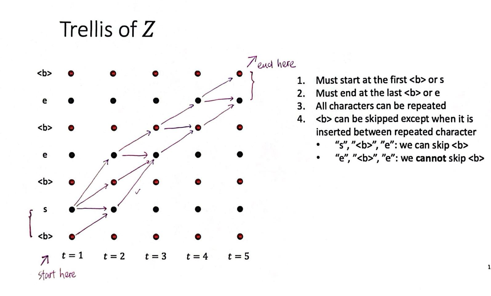
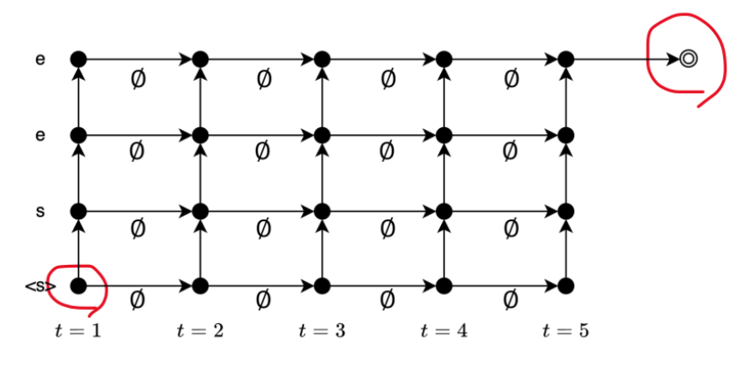
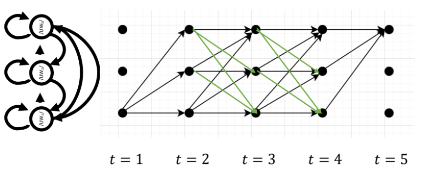

# Formulation with Hard Alignments

9/18/2024

___

## Hard Alignments

- used in CTC, HMM and RNN transducer (except attention model)
- monotonic

  - machine translation is not monotonic

## CTC

**sound -> speech features -> CTC -> text**

- no intermediate reprsentations

### problem with repeat tokens

- not given the correct transcription
  - how do we know if it is "SEE" or "SE"?
  - -> introduce a blank symbol `<b>`
  - [SSSSSEEEEEEEEEE] would be different to [SSSSSEEEE<b>EEEEE]

- insert `<b>` between tokens
  - "E" -> ("E", "E", "<b>") or ("E", "<b>", "<b>") ...
  - must be inserted between repeated tokens
  - could be omitted between different tokens
  - $f:\mathbb{Z} \rightarrow \mathbb{W}$ would be a many-to-one mapping
    - a.k.a one sequence could have multiple frame sequences
- Trellis of $\mathbb{Z}$ [IMPORTANT]

#### actual function

- $\mathbb{Z} = (z_t \in \mathbb{V} \cup{\text{<b>}} | t = 1, 2, \cdots T)$
- $|\mathbb{Z}| = |O| = T$ 
  - same length!

$$
\begin{align*}
p(W|O) &= \sum_{Z \in f^{-1}(W)} p(Z|O) \tag{LoTP} \\
&= \sum_{Z \in f^{-1}(W)} \prod_{t = 1}^{T} p(z_t|z_{1:t-1}, O) \tag{chain rule}\\
&= \sum_{Z \in f^{-1}(W)} \prod_{t = 1}^{T} p(z_t|O) \tag{cond. indep. assumption}
\end{align*}
$$

## RNN Transducer

**sound -> speech features -> RNN -> text** (end-to-end)

- different hard alignment schema than CTC
- instead of inserting `<b>` as boundaries,
  - RNN method only mark the transition points
  - [SEE] -> [S∅∅EE∅∅∅] or [S∅∅E∅∅E∅∅] ...
  - $f : \mathbb{Z} \rightarrow \mathbb{W}$ is one-to-many mapping

#### the actual function

- $\mathbb{Z} = (z_t \in \mathbb{V} \cup \empty | t = 1, 2, \cdots T + J)$
- $|\mathbb{Z}| = T + J$ 
- does not use the conditional independence assumption
  - use a special kind of NN instead

$$
\begin{align*}
p(W|O) &= \sum_{Z \in f^{-1}(W)} p(Z|O) \tag{LoTP} \\
&= \sum_{Z \in f^{-1}(W)} \prod_{k = 1}^{T+J} p(z_k|z_{1:k-1}, O) \tag{chain rule}\\
&= \sum_{Z \in f^{-1}(W)} \prod_{k = 1}^{T+J} p(z_k|f(z_{1:k-1}), O) \tag{we don't make assump.}
\end{align*}
$$

## HMM

**feature extraction -> acoustic modeling -> lexicon -> language modeling -> text** (not end-to-end)

- use a dictionary to convert word into phoneme sequence
- insert `|SilB|`, `|SP|` and `|SilE|`
- extend each phoneme into three states
  - $|AW|$ -> $|AW_1|$, $|AW_2|$ and $|AW_3|$

- allow skipping states
- allow going back (green arrows)
- and we connect each three-state phoneme

#### the actual function

- $\mathbb{S} = (s_t | t = 1, 2, \cdots T)$
- $|\mathbb{S}| = |O| = T$ 

$$
\begin{align*}
p(W|O) &\propto \sum_{L} p(O|L) p(L|W) p(W) \tag{formula} \\
&= \sum_{L} \sum_{S} p(O, S|L) p(L|W) p(W) \tag{LoTP}\\
&= \sum_{L} \sum_{S} p(o_1|s_1, L)p(s_1|L) \prod_{t=2}^{T}p(o_t|s_t, L)p(L|W)p(W) \tag{CIS}
\end{align*}
$$

--> great, let's do *dynamic programming*

| l.ab => <ab.l, in[l]{A * (B + C)} (ab.r)>
