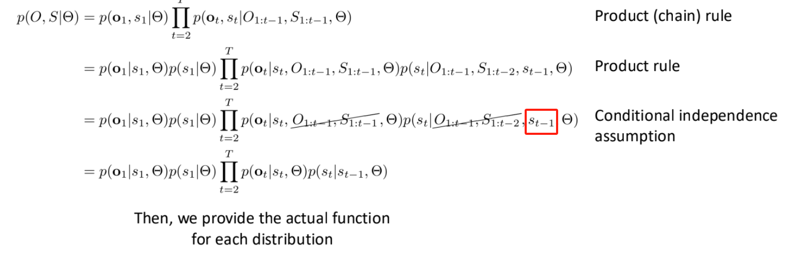
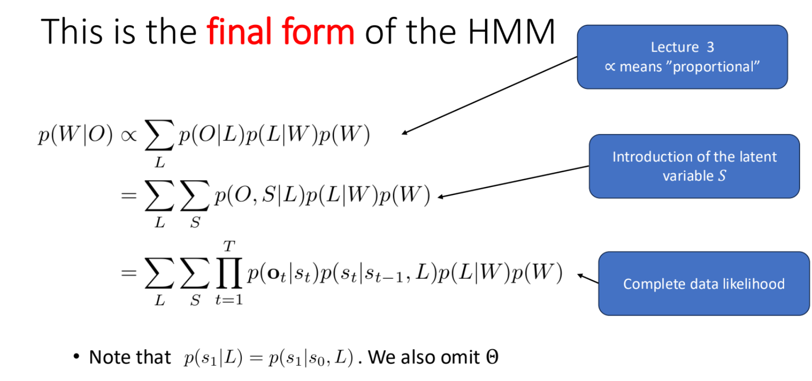
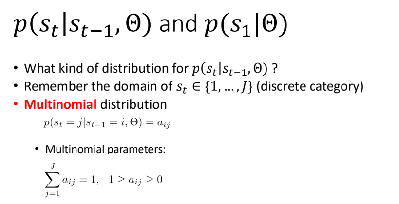
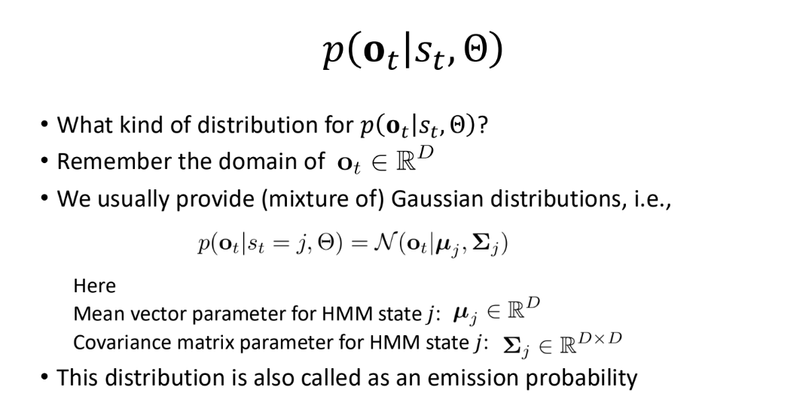
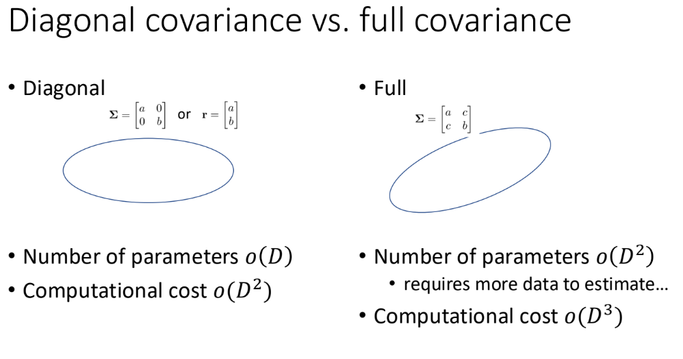
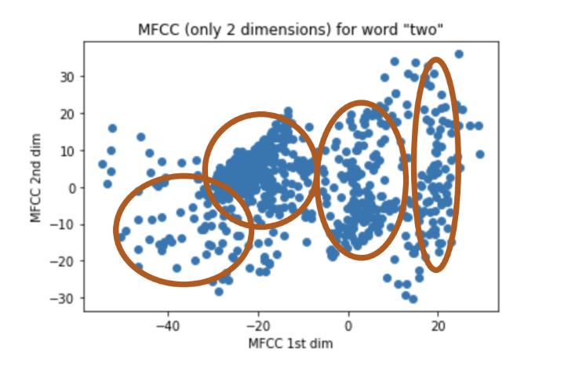

# Hidden Markov Model

9/23/2024

___

## HMM Hidden Markov Model [IMPORTANT]

- based on the EM (Expectation Maximization) algorithm
  - introduce latent variable
  - complete data likelihood
  - auxiliary function (E-step)
  - parameter estimation (M-step)
- Pros
  - monotonic behavior (of Likelihood (likelihood must be increased
    during the iterations. Easy to debug)
  - easy to distribute
- Cons
  - local optimum
  - initialization dependent

### Introduction of latent variable

- introduce **alignment variable** ($S$) as the latent variable
- $p(O|\theta) = \sum_{s}p(O, S|\theta)$

### Complete data likelihood

In the first order HMM model, we assume the current observation is independent of all previous observations; the current state is only dependent of ONE previous state.

[IMPORTANT]

#### Actual functions for each probability term

- NN
- plug in an *appropriate* distribution

#### Diagonal Covariance vs. Full Covariance

Consider performance, use Gaussian mixture with multiple diagonal covariance

### Auxiliary Function

- Expectation of the complete data likelihood with respect to the posterior distribution of a latent variable sequence
- $Q(\theta, \theta') = \sum_{s \in S} p(s|O, \theta')\log{p(O, s | \theta)}$
  - summation over all possible sequences
  - 3 states per phoneme, TOO MANY possible sequences
- 

==revisit==

### Parameter Estimation 

- we have an auxiliary function
  - take derivative and find argmax

