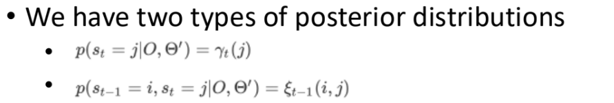
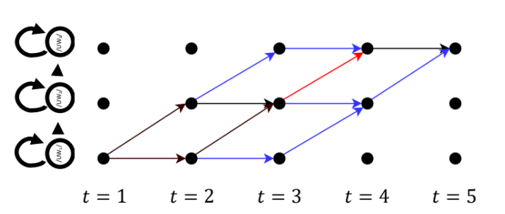
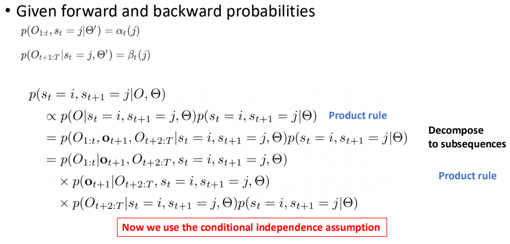
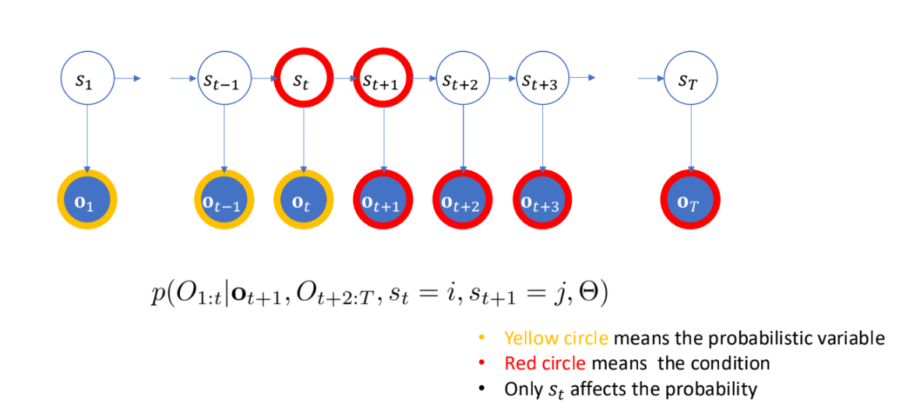
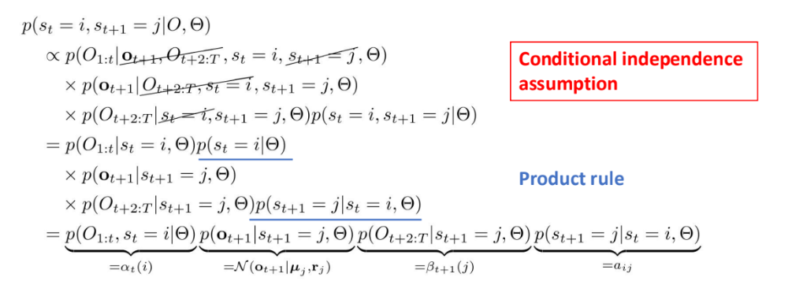
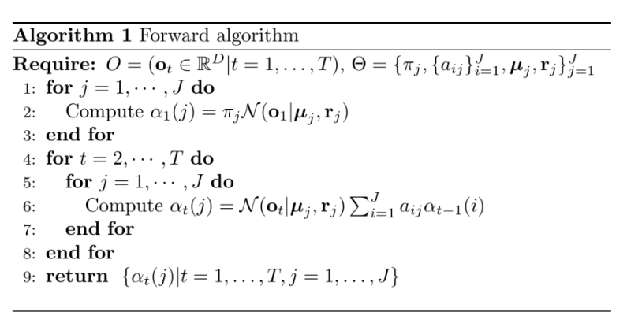
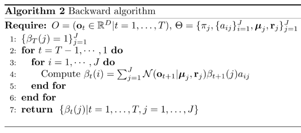
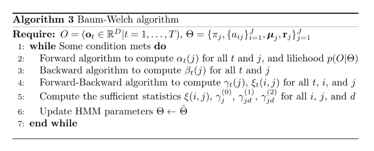

# Forward-backward Algorithm for HMM

9/25/2024

---

### Distributions mentioned last time...

On a diagram like this:

- the first posterior distribution is the probability of a path given the exact state at the exact time stamp
- the second posterior distribution is the probability of a path given a state transition point between exact two time stamps

-> use **forward probability** and **backward probability**

## Forward Backward Probability

### Conditional Independence Assumption

- given the HMM model, we can simplify the probability
  - it is *assumption* based on the model

{forward} * {Gaussian distribution} * {backward} * {transition}

[IMPORTANT]

### Forward Algorithm

- derive the first one

- recursively compute the next

- complexity $O(J^2T)$

### Backward Algorithm

### Baum-Welch Algorithm

