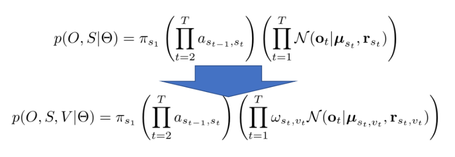
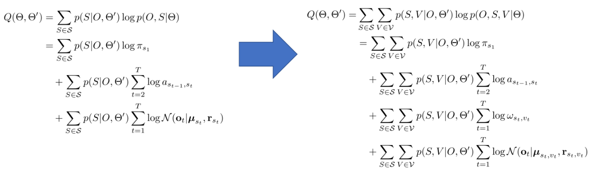
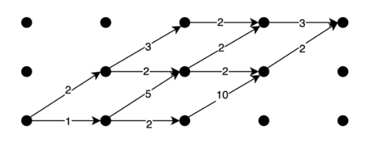
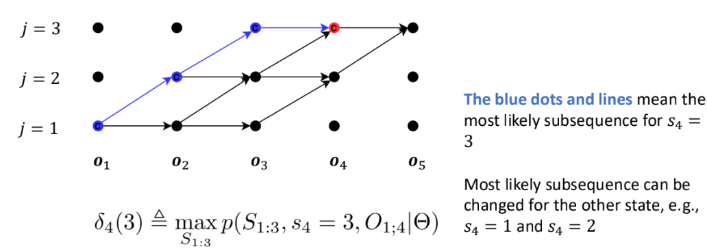
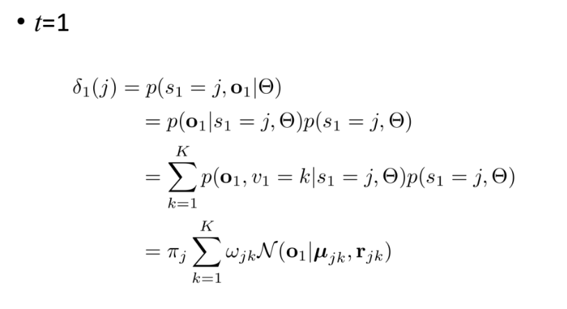
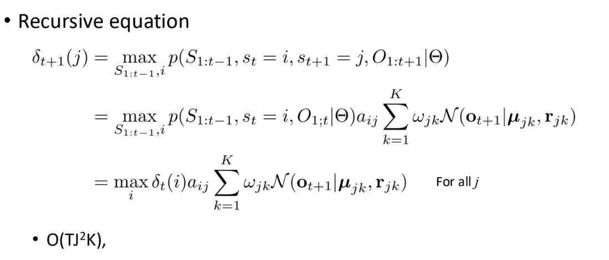
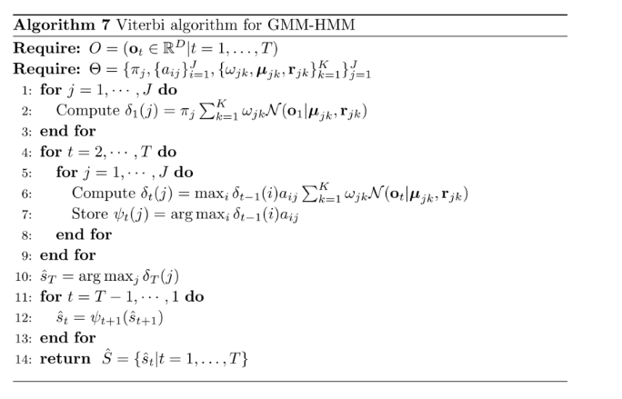
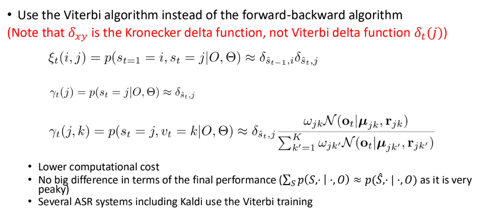

# GMM Extensions and Viterbi Algorithm

9/30/2024

___

## Gaussian Mixture Model GMM

$p(o_t|\theta) = \sum_{k \in K} w_k \mathcal{N}(o+t|\mu_k, r_{k})$

- weighted sum over $k$ Gaussian distributions
  - where $w_k$ is the weight and $\sum_{k \in K} w_k = 1$

- ambiguity on the graph
  - introduce one more latent variable $\mathcal{V} = (v_t \in \{1, 2, \cdots K\} \mid  t \in 1,2,\cdots T)$
- $p(o_t|s_t = j, \theta) = \sum_{k \in K} w_{jk} \mathcal{N}(o+t|\mu_{jk}, r_{jk})$

- likelihood
  - 
- auxiliary function
  - 
  - very similar to single Gaussian, just one more parameter

## Graph Search

- decide which sequence is the most probable
  - -> search problem

- random path? 🙅‍
- greedy search -> always go to the **one best** possible next node
- beam search ->  always go to the **k best** possible next node
  - $k=1$ is greedy search
  - $k \rightarrow \inf$ is full traversal (best approximation, but computational heavy)
- Viterbi search

## Viterbi Search

- compute the most likely state sequence
  - $\hat S = \arg \max_{s \in S}{p(s|O, \theta)}$
- for each node, we find the best path to get there

#### Algo.

$$
\delta(j) = \max_{s_{1:t-1}}{p(S_{1:t-1, s_t = j, O_{i;t}|\theta})}
$$

ビタービ

### Viterbi Training

- replace summation over all possible sequences with the *Viterbi path*

