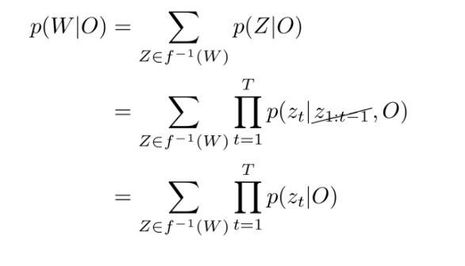
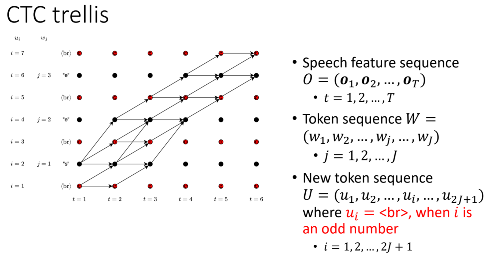
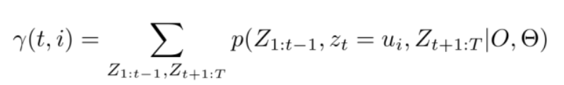
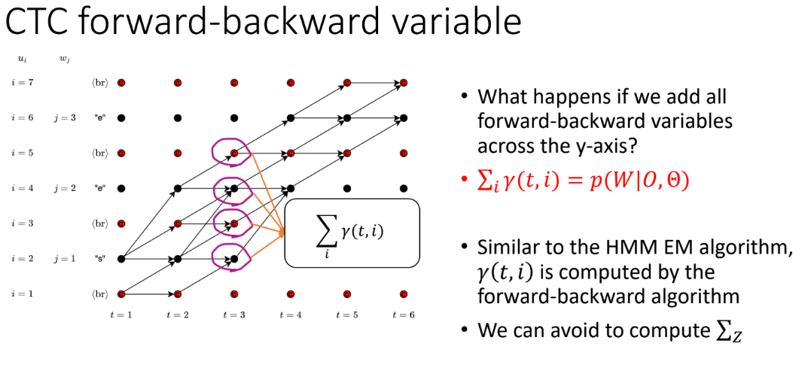
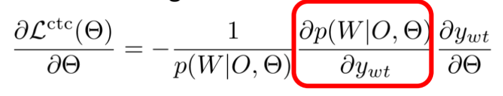
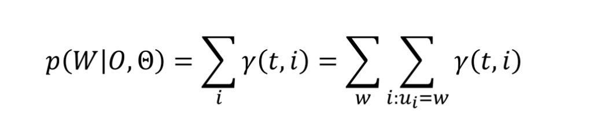
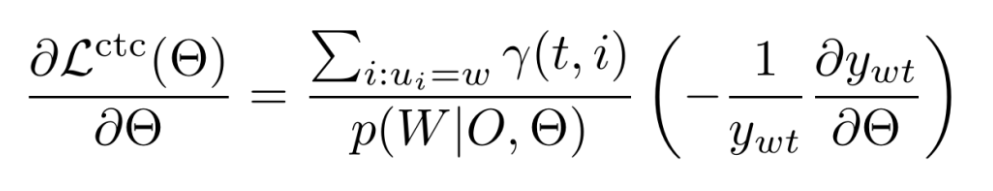
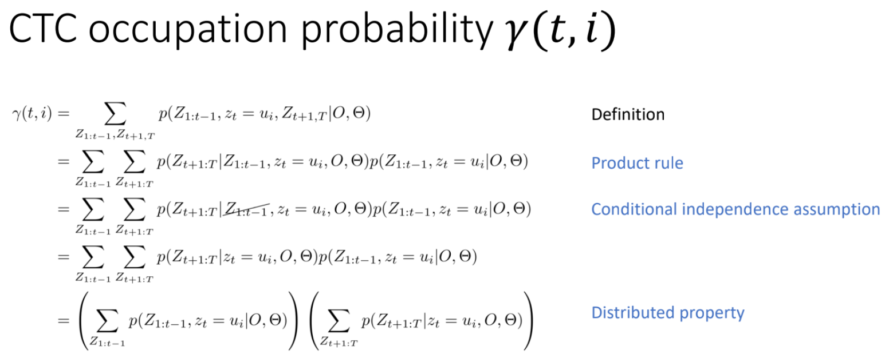
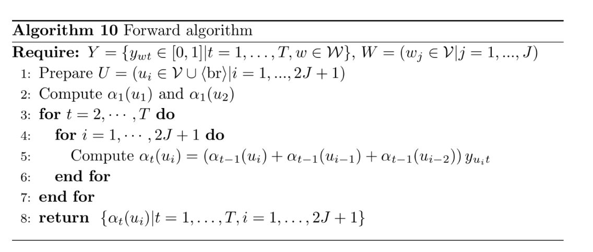
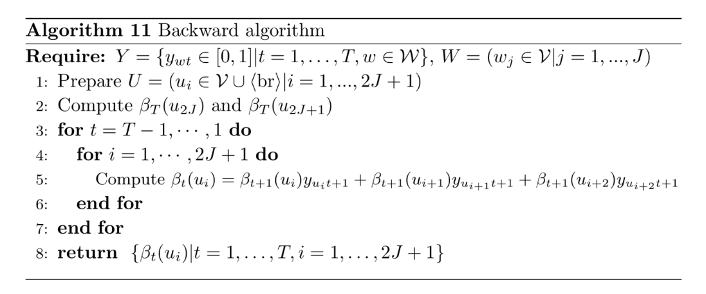

# 10 Forward-backward Algorithm for CTC

10/2/2024

___

[IMPORTANT] why we have 5 quizzes in one lecture... CTC is soooo important?

## CTC loss function

- we need to introduce latent variable $\mathbf{Z}$

- and use it as the objective function
  - could not use EM because it is complicated
  - use gradient descent instead
  - but we are still dealing with summation over all possible sequences
- use forward-backward algorithm

## Forward-backward 

#### Occupation Probability

$\gamma(3, 4)$: the probability that the path passes through the point $t = 3$ and $i=4$

- forward direction: all paths that go from the initial points to a certain point
- backward direction: all paths that go from  a certain point to the end points

where $\mathbf{Z}_{x:y}$ means all path from time stamp $x$ to $y$

summing up at one time stamp will give the probability of all possible paths (as lined), which correspond to $P(W|O, \theta)$ ($\ne 1$!)

### Move to gradient descent

We want to calculate the circled part of the derivative, so we need to link $p(W|O, \theta)$ with $w$, which is the tokens.

- at each time stamp, each token may appear multiple times on the graph
- the probability that $p(w|t)$ is calculated as the sum of all the $\gamma(t, i)$ values that correspond to the token $w$

therefore

and math... and the final result

## Forward-backward Algorithm for $\gamma$

### Forward Direction

Similar to HMM forward, we find $\gamma$ of the next node from all nodes that could go into it

### Backward Direction

