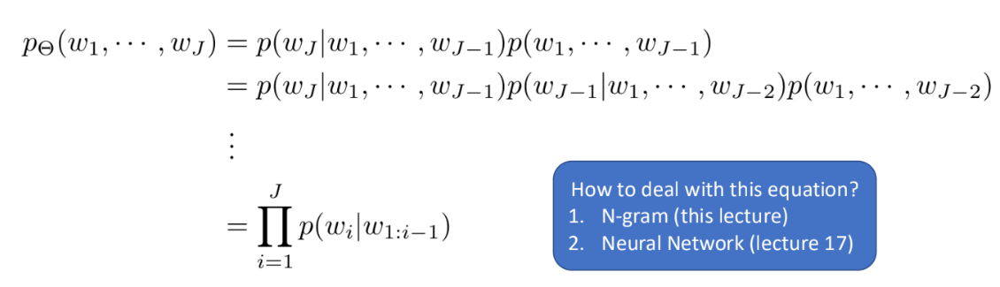
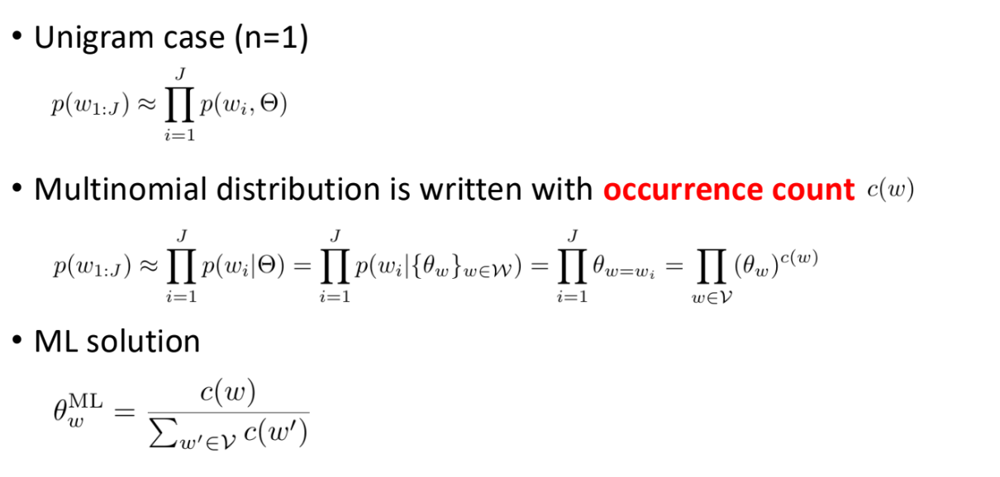
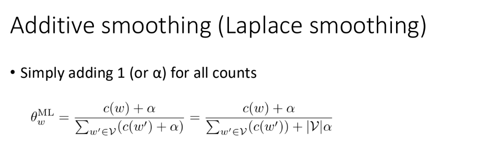
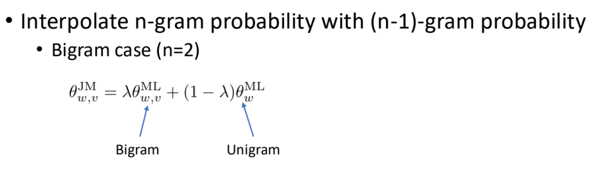
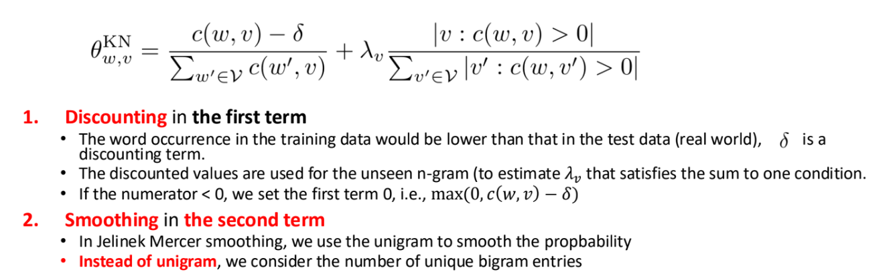

# 11 N-gram Language Models

10/7/2024

___

### Language Model in ASR Pipeline

- $\arg\max{P(W|O)}$: find the best word sequence given observation
  - most probably word sequence

### Markov Assumption

- assume the probability of $w_i$ is only dependent of $n$ previous words, $W_{i-n+1:i-1}$
  - n-gram assumption

note that *ML* means *Maximum Likelihood* here

#### Unigram

- just the product of probability of all words
  - no context/condition
  - order does not affect final score

#### Bigram

- only consider the previous word
  - $p(\text{I want to go to}) = p(\text{I}) p(\text{want} | \text{I}) p(\text{to} | \text{want}) \cdots$

### Zero-count problem

- n-gram (e.g. bigram) trellis is very sparse
  - many word combo have zero count from the corpus
  - and we compute the product... oops everything ZERO-OUT
- use **smoothing**

#### Laplace Smoothing (Additive Smoothing)

- $\alpha = 0$ is Maximum Likelihood
- $\alpha \rightarrow \infin$ is uniform distribution

  

#### Jelinek Mercer Smoothing (Interpolation Smoothing)

- still need to satisfy the *sum-to-one* property, so we assign $\lambda$ and $1-\lambda$ as coefficient

#### Kneser-Ney Smoothing

- The example of "reading glasses" and "reading Francisco"
  - "Francisco" has a high count, so it has higher unigram probability
  - BUT "Francisco" is always associated with "San"
  - and Kneser-Ney takes it into account

