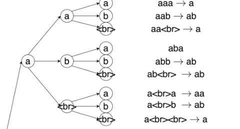

# 12 Search

10/9/2024

___

Given model, how to find the $\arg\max$?

search the best path on this tree

## Greedy Search

- simple! just go with the best path every step

## Beam Search

- beam search need to compute a score in order to rank the possible paths
- $log p (\bar W_{i:j}|O) = \log p (w_j | \hat w_{1:j−1},O) + \log p(\hat w_{1:j−1}|O)$

#### EOS

- We don't know how long the output should be 
  - include <EOS> as a separate token
  - and we store all sentences (paths) that ends with <EOS> in a pool

- and we search among the pool to find the most probable sentence
  - Output synchronous beam search

#### Output Synchronous Search

- dependent on positions in the word sequence
- attention-based ASR

#### Input Synchronous Search

- dependent on positions in the time stamp (input)
- CTC + LM or RNN

- tokens contain  
- follows CTC rules
  - remove repetition, remove blank symbols, etc.
- don't need <EOS>
  - because we have the input sequence, we know the depth ($T$)

## N-best Result

- we want the top $n$ instead of top $1$
- keep a list of good result <- naturally fits into beam search
- can apply rescoring to rerank the n-best results

### N-best list $\rightarrow$ Tree $\rightarrow$ Lattice

- merge **prefix** to convert to tree
  - equivalent transformation
- merge **suffix** to convert to lattice
  - NOT equivalent!
  - may contain word sequences that did not appear in the n-best list 

### System Combination

- combine different models to contain more information/have better performance?
- Feature level

- model level

- system level

### Combine Results - ROVER

- pick a reference
- align the results (levenshtein distance)
- combine the results
- perform voting at each position

### 
