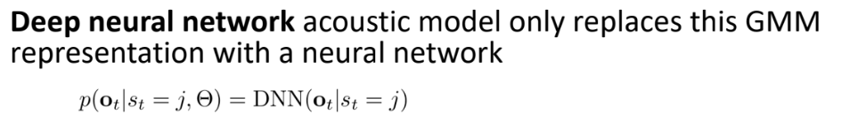
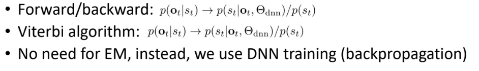
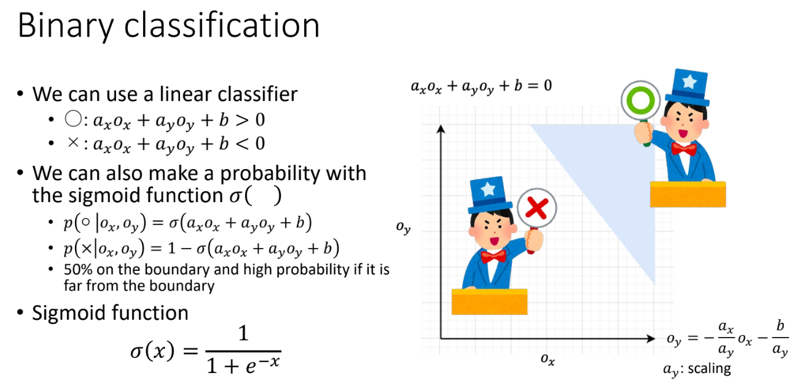
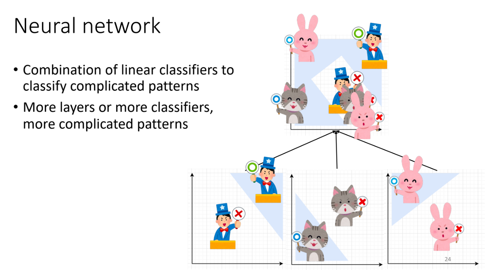

# 13 Deep Neural Network for Acoustic Modeling

10/28/2024

___

Replace Acoustic Model (GMM) with DNN (deep neural network)

### DNN/HMM Hybrid

- calculate $p(o_t|s_t, \Theta)$ by deep neural network
- and use for HMM model

## Feed-forward Neural Network

- Configs

  - input features
  - output class
  - number of layers
  - number of hidden layers
  - number of hidden state

  

very large number of linear classifiers

-> more accurate decision boundaries 

-> better classification result (similar to Gaussian Mixture Model)

## Neural Network

- back propagation
- gradient descent
  - learning rate is always a parameter that needs to be tuned
  - very sensitive to changes (not reproduceable)

## Convolution Neural Network in ASR

- spectrogram have some graphical property

### 1-D Convolution (Example)

- configurations
  - number of input channels = 1
  - number of output channels = 1
  - filter size = p
  - stride = 1 (step)
  - pad = 0

$$
y_t = \sum_{p \in P_t} o_p w_{p-t}
$$

- down-sampling
  - use *stride* operation
  - shrink the size of input

### 2-D Convolution

- configurations

  - number of input channels = N

  - number of output channels = M

  - filter size = p * q

  - stride 

  - pad
  - pooling (max or mean?)

$$
y_{tdm} = \sum_{n=1}^N \sum_{(p, q)\in P_{t, d}} o_{pqn}w_{p-t, q-d, n, m}
$$

### Pooling

- also used for utterance-level or segment-level features
  - like speaker information

## Combined Feature Extraction and Acoustic Model

- framing
  - STFT process
  - use a 1-D CNN instead
  - and use maxpooling

### CNN as a Frontend for Transformer

- CNN architecture is very good at capturing
  local feature contexts
- This is used as a frontend layer to process
  the law signals or LMF features, e.g.,
  - Transformer ASR [Dong+(2018), Karita+(2019)]
  - Wav2vec2.0 [Baevski+(2020)] and HuBERT [Hsu+(2020)]

