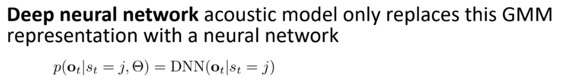
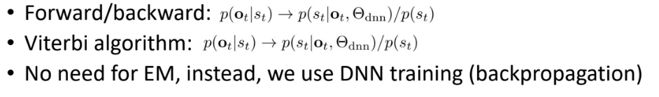

# 13 Deep Neural Network for Acoustic Modeling

10/28/2024

___

Replace Acoustic Model (GMM) with DNN (deep neural network)

### DNN/HMM Hybrid

- calculate $p(o_t|s_t, \Theta)$ by deep neural network
- and use for HMM model

## Feed-forward Neural Network

- Configs

  - input features
  - output class
  - number of layers
  - number of hidden layers
  - number of hidden state

  

very large number of linear classifiers

-> more accurate decision boundaries 

-> better classification result (similar to Gaussian Mixture Model)

## Neural Network

- back propagation
- gradient descent
  - learning rate is always a parameter that needs to be tuned
  - very sensitive to changes (not reproduceable)
  - 

