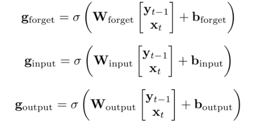
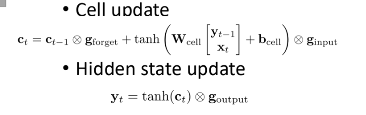

# 14 Neural Network Language Model

10/30/2024

___

## Recurrent Neural Network

- consider more context

#### Vanilla RNN

- include information from previous state, $y_{t-1}$
- if we expand it, the network remember all context from all previous states

- however, distance matters
  - farther nodes contain less information from previous states

- ends up with posterior probability $p(s_t|o_1, o_2, \cdots o_t)$
  - where HMM assumption ignores history information

#### Bidirectional RNN

- also include information from future
- combine with another backward RNN

- ends up with posterior probability $p(s_t|o_1, o_2, \cdots o_t, \cdots o_{t+1}, o_{t+1}\cdots)$

#### LSTM RNN

- normal state + memory cell
  - have longer memory from older states

- memory $c$
  - could (i) forget information (ii) remember new information (iii) output new information
  - **gating**
    - have a sigmoid function that maps $\mathbb{R}\rightarrow [0, 1]$

### Applications

## Self-attention (Transformer Encoder)

- RNN is slow
  - sequential, because require previous state
  - cannot be paralleled
- self-attention can consider the full context
  - and fully parallelized across the frames

How do we know the probability that two feature are related?

- inner product 
  - key-query
  - $o_t$ and $o_{t'}$ are features at different time that we are interested about
  - 
- make it probabilistic
  - softmax
  - 

But still very expensive

-> $O(T^2)$

for feature at each time span, find correlation with each other time span

(so let's down-sample)

​	

## Language Model $p(W)$

- previously we use Markov assumption
  - easy
  - but ignore wider context
  - and data is sparse and require smoothing

### Sparse Representation

- One-hot
  - single vector with only one 1 and 0-s o.w.
  - cosine similarity 
  - does not consider word/token-wise similarity
  - "CMU" vs. "office" has the same difference as "CMU" vs. "sleep"

- word embedding ⭐
  - dense vector that map a word to a high dimension vector
  - similar words are closer

TBC. how to get word embedding

## Casual Transformer for Language Model

- normal attention
  - but need to mask *non-casual* attention arrows

### Masked Language Model

#### Sentence Generation

- generate with a prompt (additional information)
  - additional information could also be images
  - or audio ...!?

