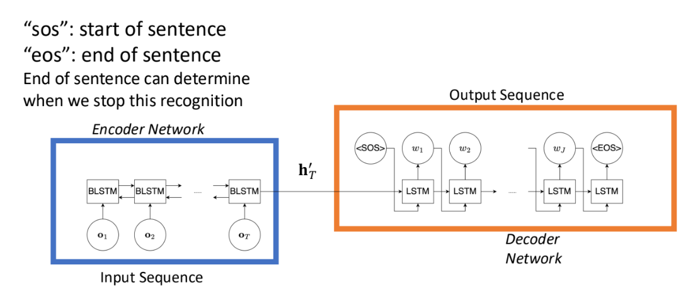

# 15 End-to-End ASR (Attention)

11/4/2024

___

## Attention Based Encoder-Decoder

- setup

  - given $O$ as a sequence of observed features
  - find the word sequence $W$ that maximize $p(W|O)$

- 

  - there is no high level assumptions made
  - e.g. conditional independence for CTC

- to represent $p(w_j|w_{1:j-1}, h')$

  - 
  - where $h'$ is the internal representation
  - 

- use **attention** to solve the alignment issue

  - "attention is just a weighted sum"
  - use the weights to perform a soft alignment
    - ONLY speech recognition is required to be *monotonic*
    - because it is time-based
    - but the model architecture does not guarantee monotonic alignment
  - if non-monotonic, may cause repeating output sequences

#### How to obtain Attention Weight

- We want to get the information of how token $w_j$ is related to encoder state vector $h_t$
- information retrieval
  - query is $w_j$
  - key is $h_t$
  - relevance is calculated by a function $f (w_j, h_j)$
    - and apply softmax to make it a probability value
    - which can be used as attention weight
    - called *cross-attention*
  - 
- 

## Transformer

#### Multi-head Attentions

- could be monotonic (left)
  - capture some close context (top)
  - clean alignment (bottom)
- could also be (right)
  - capture global information
- attention model is more extensible
  - no need to change the model
  - could insert special token
    - that the attention will consider through out all nodes

