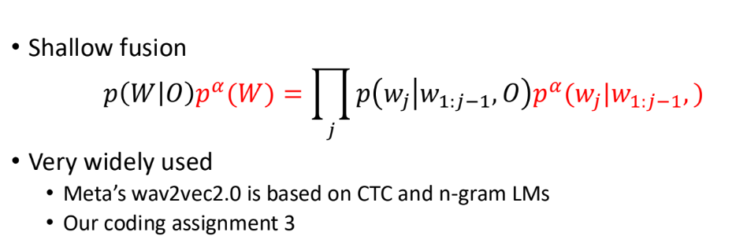

# 16 End-to-End ASR: CTC

11/6/2024

___

### CTC Condition

- when token length is too large
  - and the input feature is short
- may be because of
  - large down sampling
  - wrong data alignment

### Inference for CTC

- if using greedy search
  - the final $\arg\max$ is just $\arg\max$ at each point
  - we can parallel the decoding!
  - *non-autoregressive* model

### Shallow Fusion

LM shallow fusion with CTC

