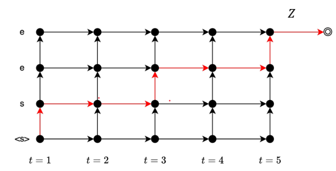

# 17 End-to-End ASR RNN Transducer

11/11/2024

___

## RNN Transducer

- Again, based on RNN tatrice
- consider the partial alignment
  - $Z_{1:5}$ is {s, <b>, <b>, e, <b>} and it represents the sequence "s e"

==missing here==

|                                     | HMM  | Attention | CTC  | RNN  |
| ----------------------------------- | ---- | --------- | ---- | ---- |
| End-to-End                          |      | *         | *    | *    |
| Conditional Independence Assumption | *    | (*)       | *    |      |
| Hard Alignment                      | *    | *         | *    |      |
| Streaming                           | *    |           | *    | *    |
| Language Model (non internal)       | *    |           | *    |      |
| Teacher Forcing                     |      | *         |      | *    |
| Parallel Inference                  |      |           |      |      |
| Phoneme                             | *    |           |      |      |

